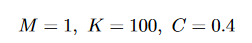

# OpenSMDREnv: Reinforcement learning environment for spring-mass-damper system
Rohan Thorat, Juhi Singh, Prof. Rajdip Nayek 

This package includes 1-DOF, 3-DOF, 5-DOF, and 76-DOF dynamical system environment.
To install this package, run the below command [CURRENTLY PIP INSTALL OPTION IS NOT AVAILABLE]:
```{bash}
pip install OpenSMRDEnv
```


Users can change the default mass, spring, and damper properties, i.e. mass, stiffness, and damping coefficient.

Requires:
* `numpy`
* `gymnasium`
* `scipy`

## Environments detail
### 1-DOF:
Default system parameter values are defined as below:

$\Delta t = 0.01$

<p align="center">
  
</p>

### 3-DOF:
Default system parameter values are taken from this article: https://ascelibrary.org/doi/abs/10.1061/(ASCE)0733-9399(1989)115:8(1609)

$\Delta t = 0.01$

<p align="center">
  
</p>

### 5-DOF:
Default system parameter values are taken from this article: https://ascelibrary.org/doi/10.1061/%28ASCE%29EM.1943-7889.0001226

$\Delta t = 0.01$

<p align="center">
  
</p>

The exact values of the M, K, and C matrix are stored in the file named '5dof_MKC_matrix.mat' located in the 'src' folder.

### 76-DOF:
The 76-DOF dynamical system is of 76-story 306 m concrete office tower proposed for the city of Melbourne, Australia. It is a benchmark system which is usually used in the domain of mechanical and civil engineering.
Default system parameter values are taken from this article: https://ascelibrary.org/doi/10.1061/%28ASCE%29EM.1943-7889.0001226

$\Delta t = 0.01$

The values of the M, K, and C matrix are stored in the file named '76dof_MKC_matrix.mat' located in the 'src' folder.


## Basic coding syntax

Initialize the environment as env = dof{n}.DynamicEnv(); where 'n' is number of degree of freedom (for n=3: env = dof3.DynamicEnv())

The main line of code:
```{bash}
reward, env_state, env_acceleration = env.step(action, env_state, ground_acceleration)
```

Here env_state is the state of the dynamical system i.e. its displacements and velocity. Action is input control force vector of size 'n'.


